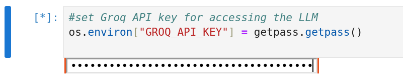
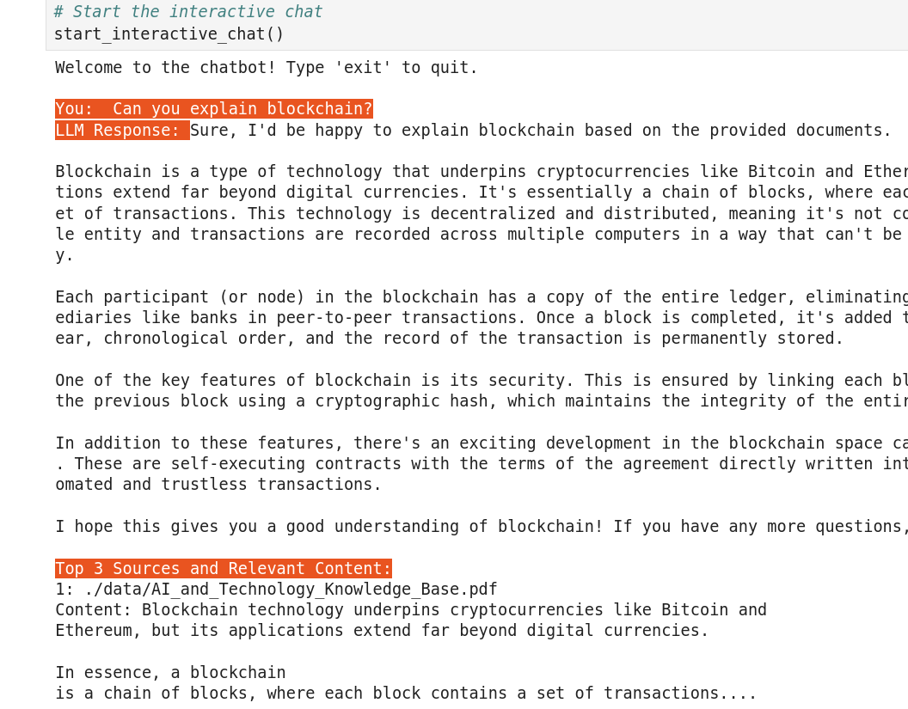

# xaver_challenge
Developing a RAG chatbot using Langchain  as part of a coding challenge.


## Features

### 1. **Linguistic-Based Splitting and Semantic search**
   - Splits document into smaller chunks using NLTKTextSplitter(Linguistic-Based) 
   - Uses vector embedding (all-mpnet-base-v2) and a vector database(Chroma) to store document embeddings, enabling semantic search.


### 2. **Generative Response with LLM**
   - Generates detailed responses by integrating the retrieved information and the original user query.
   - Choice of LLM (mixtral-8x7b-32768), you can use different models from Open AI or some other inference method.

### 3. **Custom Template**
   - If the user asks a question outside the scope of available sources, the chatbot responds with "I don't know" and attempts to seek clarification by asking questions from relevant sources.


### 5. **Chat History**
   - Chat histrory allows the LLM to understand the conversation and reply with better clarity.

### 5. **Sources**
   - The chatbot provides top 3 sources for every question asked.


## Environment Setup

Before you start, you need to have Python installed.  

### *** 1. Create a virtual environment: ***

```bash
python -m venv env
```

### *** 2. Activate the virtual environment: ***

On Windows, run:

```bash
.\env\Scripts\activate
```

On Unix or MacOS, run:

```bash
source env/bin/activate
```


### *** 3. Install the requirements: ***

```bash
pip install -r requirements.txt
```


The `requirements.txt`  contains the necessary libraries for this project.

## API Key Setup

You need to have a Groq API key to acess the llm. 

1. Sign up or log in to Groq.
2. Go to your dashboard and generate a new API key.
3. The below code snippet can be found in the notebook to set the API key

```bash
os.environ["GROQ_API_KEY"] = getpass.getpass()
```




Replace `your_api_key` with the actual API key you got from Groq.

## Usage

1. Open the main.ipynb and run all the cells one by one. A modular structure can be introduced to avoid this. 
2. The main function to call is `chat_with_llm(prompt, chat_history=[], custom_template=PROMPT_TEMPLATE)`. 
3. You can  use the interactive mode. Just call `start_interactive_chat()` and start chatting. Type 'exit' or 'quit' to end the session.

The ouput might look something like the below image.




### Research- references: https://python.langchain.com/docs/tutorials/rag/

